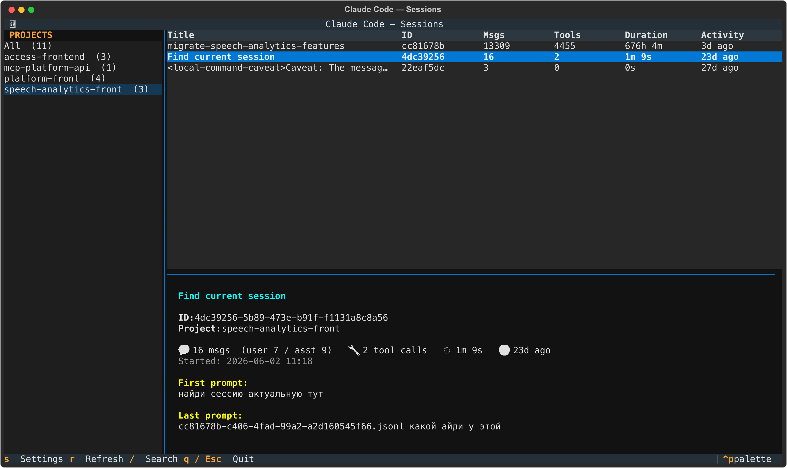
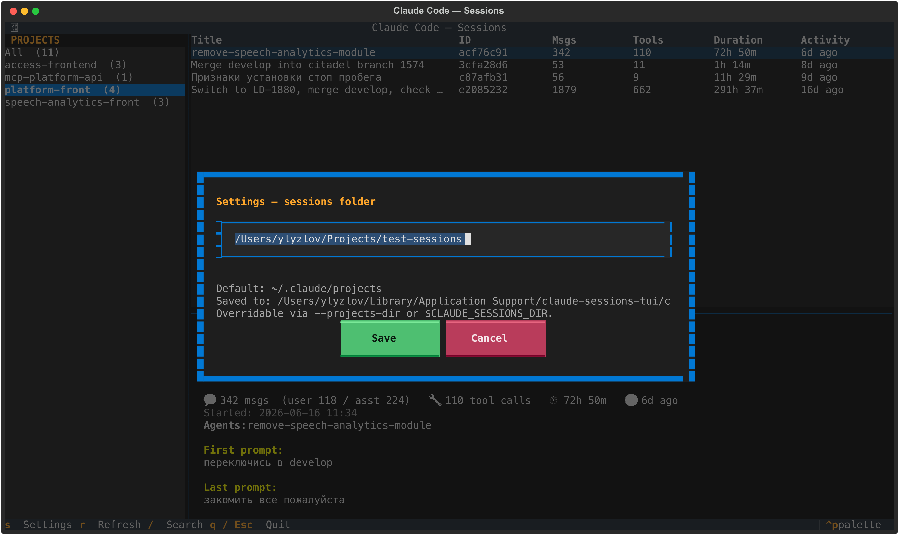
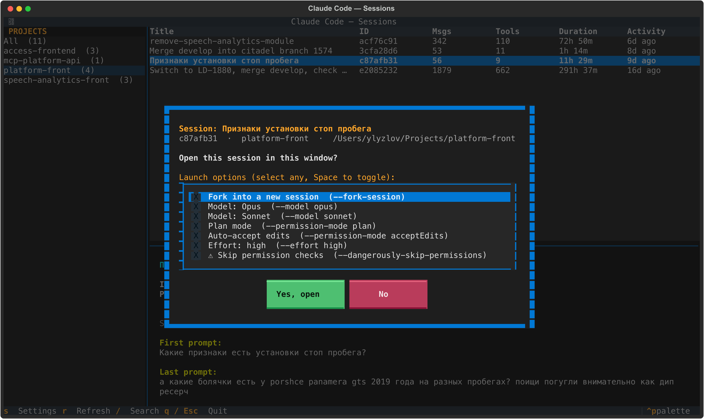

# claude-sessions-tui

A console (TUI) tool for browsing Claude Code sessions. It reads the jsonl files
from `~/.claude/projects/<project>/<sessionId>.jsonl` and shows, per session,
the **title + ID + a short review** (first/last prompt, stats, timing, PR).



## What it shows

- **Title** — custom (`custom-title`) → AI title (`ai-title`) → first prompt
- **ID** of the session (short in the table, full in the detail panel)
- **Review** — first and last prompt, message / tool-call counts, duration,
  last-activity age, sub-agents used, linked PR/MR

## Install

### Homebrew (tap)

```bash
brew tap lyzlov-twelve/tap
brew trust lyzlov-twelve/tap        # Homebrew 6+ requires trusting third-party taps
brew install claude-sessions-tui
claude-sessions
```

> **Note:** the formula builds a Python virtualenv, so it needs a healthy
> Homebrew Python toolchain. On macOS with an outdated Xcode/Command Line Tools
> the build can fail with a `pyexpat … Symbol not found` error — update Xcode
> (App Store) or the CLT (`softwareupdate --install --all`) and retry. If you
> hit that, the `uv` method below works regardless of the system toolchain.

### uv (works everywhere)

`uv` ships its own Python (with a bundled libexpat), so this is the most robust
option and avoids any system-toolchain issues:

```bash
uv tool install "git+https://github.com/lyzlov-twelve/claude-sessions-tui@v0.1.0"
claude-sessions
```

### From source

```bash
cd ~/Projects/claude-sessions-tui
uv run claude-sessions          # or: uv run python -m claude_sessions
```

## Keys

| Key | Action |
|-----|--------|
| `↑` / `↓` | navigate the list (projects or sessions) |
| `→` | move from the projects list into the sessions list |
| `←` | move back from sessions to the projects list |
| `Tab` | switch focus (projects ⇄ table) |
| `Enter` / `c` | **open the session in Claude** (opens a confirmation dialog) |
| `/` | search by title / prompt / id |
| `s` | **settings** — change the sessions folder |
| `r` | rescan sessions |
| `Esc` | clear the search if active, otherwise quit |
| `q` | quit |

## Settings — sessions folder



By default the tool reads `~/.claude/projects`. You can point it elsewhere
(resolution order, highest priority first):

1. CLI flag — `claude-sessions --projects-dir /path/to/projects`
2. Env var — `CLAUDE_SESSIONS_DIR=/path/to/projects claude-sessions`
3. In-app settings — press `s`, edit the path, **Save** (persisted to a config
   file under your user config dir, e.g. `~/Library/Application Support/claude-sessions-tui/config.json`)
4. Default — `~/.claude/projects`

## Launching a session in Claude

Selecting a session (`Enter` or click) opens a dialog
**"Open this session in this window?"** with a multi-select list of launch
options (toggle with `Space`, several can be combined):



| Option | Adds |
|--------|------|
| Fork into a new session | `--fork-session` |
| Model: Opus / Sonnet | `--model opus` / `--model sonnet` |
| Plan mode | `--permission-mode plan` |
| Auto-accept edits | `--permission-mode acceptEdits` |
| Effort: high | `--effort high` |
| ⚠ Skip permission checks | `--dangerously-skip-permissions` |

Selecting nothing launches `claude --resume <id>` as-is. After **"Yes"** the TUI
suspends, the terminal is handed to Claude Code in the session's working
directory, and you return to the list once you exit (`/exit` or `Ctrl-D`).

## Layout

```
claude_sessions/
├── parser.py   # scan + parse jsonl → Session model
├── app.py      # Textual app (UI + events + LaunchDialog)
└── __main__.py
```

## Possible next steps

- On-demand LLM summary of a session (Claude API) cached to a file
- Full transcript view on a key press
- Column sorting, export to markdown
